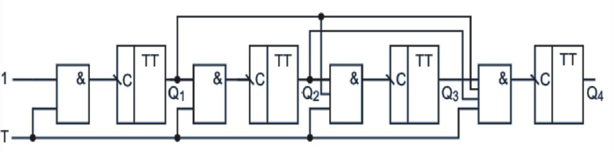

[author]: <> (Орлов Алексей)
[page-size]: <> (210 297)

[include-pdf]: <> (titul1.pdf)

# Счетчики с параллельным переносом: схема, принцип функционирования и назначение

## Описание

Счетчики с параллельным переносом являются важными компонентами в цифровой электронике. Они используются для подсчета событий, генерации временных интервалов и в качестве делителей частоты. Они находят широкое применение в компьютерных системах, цифровых схемах и устройствах обработки сигналов.

## Схема счетчика с параллельным переносом

Счетчик с параллельным переносом состоит из нескольких триггеров (обычно типа JK или D) и логических элементов, таких как элементы И и ИЛИ, которые обеспечивают передачу переноса между разрядами. Рассмотрим 4-разрядный счетчик, состоящий из четырех триггеров и логики передачи переноса. 

На схеме видно, что каждый триггер управляется своим входом тактового сигнала, а логические элементы между ними обеспечивают перенос значений с одного разряда на другой. Основная идея заключается в том, что перенос происходит синхронно, что позволяет избежать задержек, характерных для асинхронных счетчиков.

## Принцип функционирования

В счетчиках с параллельным переносом все триггеры синхронизируются одним тактовым сигналом, что обеспечивает их одновременное переключение. Это означает, что счетчик изменяет свое состояние на каждом тактовом импульсе.

Основные этапы работы счетчика с параллельным переносом:

1. **Начальное состояние**: Все триггеры находятся в исходном состоянии (например, все в нулевом положении).
2. **Получение тактового импульса**: При поступлении тактового импульса первый триггер переключается.
3. **Перенос**: Если первый триггер переходит из состояния 1 в состояние 0 (переполнение), то сигнал переноса передается на следующий триггер.
4. **Синхронное переключение**: Следующий триггер переключается одновременно с тактовым импульсом, если на него поступает сигнал переноса. Этот процесс продолжается до старшего триггера.

Рассмотрим пример 4-разрядного счетчика:
- Начальное состояние: 0000.
- Первый тактовый импульс: состояние 0001.
- Второй тактовый импульс: состояние 0010.
- Третий тактовый импульс: состояние 0011.
- Четвертый тактовый импульс вызывает перенос: состояние 0100.

## Назначение

Счетчики с параллельным переносом имеют следующие применения:

1. **Подсчет событий**: Используются для подсчета различных событий в цифровых системах, таких как количество импульсов, оборотов или операций.
2. **Генерация временных интервалов**: Применяются в схемах синхронизации для создания временных задержек и интервалов.
3. **Деление частоты**: Используются для уменьшения частоты входного сигнала, например, для генерации частоты тактового сигнала, используемого в микропроцессорах.
4. **Шифраторы и дешифраторы**: В различных цифровых устройствах для кодирования и декодирования сигналов.
5. **Автоматизация и управление**: В системах автоматического управления, где требуется точный подсчет и синхронизация процессов.

## Преимущества и недостатки

**Преимущества:**
- **Скорость**: Благодаря синхронной работе всех триггеров счетчики с параллельным переносом обладают высокой скоростью.
- **Надежность**: Снижение вероятности ошибок, связанных с задержками переноса.
- **Простота синхронизации**: Легко синхронизируются с другими цифровыми схемами.

**Недостатки:**
- **Сложность схемы**: Требует большее количество логических элементов для реализации переноса.
- **Потребление энергии**: Более сложные схемы могут потреблять больше энергии.

## Вывод

Счетчики с параллельным переносом представляют собой важный инструмент в арсенале цифровой электроники, обеспечивая точный и быстрый подсчет и синхронизацию. Они находят применение в широком спектре задач, от простых подсчетов до сложных систем управления и обработки сигналов. Несмотря на некоторые недостатки, такие как сложность схемы, их преимущества делают их незаменимыми в современной цифровой технике.
