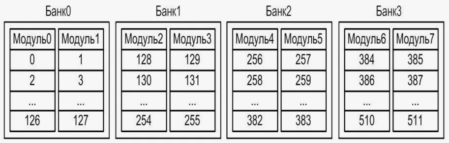

[author]: <> (Орлов Алексей)
[page-size]: <> (210 297)

[include-pdf]: <> (titul2.pdf)

# Расслоение памяти: концепция, принцип функционирования и назначение

## Описание

Расслоение памяти - одна из техник, используемых для повышения производительности системы памяти. Эта концепция играет ключевую роль в обеспечении эффективного доступа к данным и оптимизации использования памяти.

## Концепция расслоения памяти

Общее адресное пространство разделяется на несколько банков памяти, которые могут работать параллельно. В традиционной одноячеечной памяти доступ к данным происходит последовательно, что может приводить к задержкам. В системах с расслоением памяти, данные распределяются по различным банкам памяти, что позволяет осуществлять параллельный доступ к нескольким блокам данных.

## Схема расслоения памяти

На схеме ниже показано, как адресное пространство разделяется между различными банками памяти:

Адресное пространство делится на четыре банка памяти (Банк 0, Банк 1, Банк 2, Банк 3). Когда процессор запрашивает данные по адресу, соответствующему определенному банку, он может одновременно запрашивать данные и из других банков, если те адреса принадлежат разным банкам.

## Принцип функционирования

Основная идея расслоения памяти заключается в том, чтобы чередовать адреса между разными банками памяти, позволяя системе обращаться к нескольким банкам одновременно. Это достигается следующими способами:

1. **Разбиение адресного пространства**: Адресное пространство делится на строки, столбцы и банки. Например, младшие биты адреса могут указывать на столбец, а старшие — на банк памяти.
2. **Распределение данных**: Данные распределяются по банкам таким образом, чтобы соседние адреса попадали в разные банки. Это позволяет осуществлять параллельный доступ к соседним адресам.
3. **Параллельный доступ**: При запросе на чтение или запись процессор может одновременно взаимодействовать с несколькими банками памяти, что значительно увеличивает пропускную способность системы.

Рассмотрим пример 4-битного адреса и 4 банков памяти:
- Биты адреса: A3 A2 A1 A0.
- Банк выбирается по младшим двум битам (A1 A0).
- Адресное пространство распределяется следующим образом:
  - Банк 0: адреса 00, 04, 08, 0C...
  - Банк 1: адреса 01, 05, 09, 0D...
  - Банк 2: адреса 02, 06, 0A, 0E...
  - Банк 3: адреса 03, 07, 0B, 0F...

## Назначение

Расслоение памяти используется для решения следующих задач:

1. **Повышение производительности**: Параллельный доступ к данным из разных банков позволяет уменьшить задержки при чтении и записи, увеличивая общую пропускную способность системы.
2. **Оптимизация работы процессора**: За счет уменьшения времени ожидания процессор может выполнять больше операций за единицу времени, что повышает эффективность использования ресурсов.
3. **Улучшение многозадачности**: В системах с многозадачностью и многопоточностью расслоение памяти позволяет улучшить параллельное выполнение задач за счет более эффективного доступа к разделяемым ресурсам.

## Преимущества и недостатки

**Преимущества:**
- **Увеличение пропускной способности**: Благодаря параллельному доступу к нескольким банкам памяти, система может обрабатывать больше данных за единицу времени.
- **Снижение задержек**: Позволяет минимизировать время ожидания данных, что особенно важно в высокопроизводительных системах.
- **Улучшенная многозадачность**: Оптимизация доступа к памяти улучшает работу в многозадачных средах.

**Недостатки:**
- **Сложность реализации**: Требуется более сложная архитектура памяти и управляющая логика для обеспечения параллельного доступа.
- **Затраты на оборудование**: Увеличение числа банков памяти может привести к увеличению стоимости системы.
- **Проблемы с согласованностью данных**: В системах с кэш-памятью и многопроцессорных системах может возникнуть потребность в дополнительных механизмах для поддержания согласованности данных.

## Вывод

Расслоение памяти является мощным инструментом для повышения производительности и эффективности работы компьютерных систем. Благодаря возможности параллельного доступа к данным, эта техника позволяет значительно улучшить пропускную способность и уменьшить задержки. Несмотря на некоторые сложности реализации и повышенные затраты на реализацию, преимущества расслоения памяти делают его незаменимым в современных высокопроизводительных и многозадачных системах.
